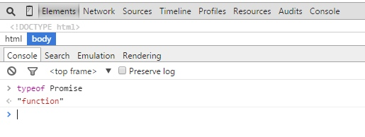

# 认识和使用Promise，重构你的Js代码

一直以来，JavaScript处理异步都是以callback的方式，在前端开发领域callback机制几乎深入人心。在设计API的时候，不管是浏览器厂商还是SDK开发商亦或是各种类库的作者，基本上都已经遵循着callback的套路。近几年随着JavaScript开发模式的逐渐成熟，CommonJS规范顺势而生，其中就包括提出了Promise规范，Promise完全改变了js异步编程的写法，让异步编程变得十分的易于理解。今天我们就来了解一下Promise。

##一 、初识Promise
Promise可能大家都不陌生，因为Promise规范已经出来好一段时间了，同时Promise也已经纳入了ES6，而且高版本的chrome、firefox浏览器都已经原生实现了Promise，只不过和现如今流行的类Promise类库相比少些API。

**1、什么是promise？**
　　所谓Promise，字面上可以理解为“承诺”，就是说A调用B，B返回一个“承诺”给A，然后A就可以在写计划的时候这么写：当B返回结果给我的时候，A执行方案S1，反之如果B因为什么原因没有给到A想要的结果，那么A执行应急方案S2，这样一来，所有的潜在风险都在A的可控范围之内了。

Promise规范如下：
* 一个promise可能有三种状态：等待（pending）、已完成（fulfilled）、已拒绝（rejected）
* 一个promise的状态只可能从“等待”转到“完成”态或者“拒绝”态，不能逆向转换，同时“完成”态和“拒绝”态不能相互转换
* promise必须实现then方法（可以说，then就是promise的核心），而且then必须返回一个promise，同一个promise的then可以调用多次，并且回调的执行顺序跟它们被定义时的顺序一致
* then方法接受两个参数，第一个参数是成功时的回调，在promise由“等待”态转换到“完成”态时调用，另一个是失败时的回调，在promise由“等待”态转换到“拒绝”态时调用。同时，then可以接受另一个promise传入，也接受一个“类then”的对象或方法，即thenable对象。

**2.promise原理分析**
      可以看到promise的规范并不是很多，下面我们一边分析promise一边自己写一个promise的实现。Promise实现的大致思路如下：

　　构造函数Promise接受一个函数resolver，可以理解为传入一个异步任务，resolver接受两个参数，一个是成功时的回调，一个是失败时的回调，这两参数和通过then传入的参数是对等的。

其次是then的实现，由于Promise要求then必须返回一个promise，所以在then调用的时候会新生成一个promise，挂在当前promise的_next上，同一个promise多次调用都只会返回之前生成的_next。

由于then方法接受的两个参数都是可选的，而且类型也没限制，可以是函数，也可以是一个具体的值，还可以是另一个promise。下面是then的具体实现：

```
Promise.prototype.then = function(resolve, reject) {  
    var next = this._next || (this._next = Promise());  
    var status = this.status;  
    var x;  
  
    if('pending' === status) {  
        isFn(resolve) && this._resolves.push(resolve);  
        isFn(reject) && this._rejects.push(reject);  
        return next;  
    }  
  
    if('resolved' === status) {  
        if(!isFn(resolve)) {  
            next.resolve(resolve);  
        } else {  
            try {  
                x = resolve(this.value);  
                resolveX(next, x);  
            } catch(e) {  
                this.reject(e);  
            }  
        }  
        return next;  
    }  
  
    if('rejected' === status) {  
        if(!isFn(reject)) {  
            next.reject(reject);  
        } else {  
            try {  
                x = reject(this.reason);  
                resolveX(next, x);  
            } catch(e) {  
                this.reject(e);  
            }  
        }  
        return next;  
    }  
};
```
这里，then做了简化，其他promise类库的实现比这个要复杂得多，同时功能也更多，比如还有第三个参数——notify，表示promise当前的进度，这在设计文件上传等时很有用。对then的各种参数的处理是最复杂的部分，有兴趣的同学可以参看其他类Promise库的实现。

在then的基础上，应该还需要至少两个方法，分别是完成promise的状态从pending到resolved或rejected的转换，同时执行相应的回调队列，即resolve()和reject()方法。

到此，一个简单的promise就设计完成了，下面简单实现下两个promise化的函数：

```
function sleep(ms) {  
    return function(v) {  
        var p = Promise();  
  
        setTimeout(function() {  
            p.resolve(v);  
        });  
  
        return p;  
    };  
};  
  
function getImg(url) {  
    var p = Promise();  
    var img = new Image();  
  
    img.onload = function() {  
        p.resolve(this);  
    };  
  
    img.onerror = function(err) {  
        p.reject(err);  
    };  
  
    img.url = url;  
  
    return p;  
};
```
由于Promise构造函数接受一个异步任务作为参数，所以getImg还可以这样调用：

```
function getImg(url) {  
    return Promise(function(resolve, reject) {  
        var img = new Image();  
  
        img.onload = function() {  
            resolve(this);  
        };  
  
        img.onerror = function(err) {  
            reject(err);  
        };  
  
        img.url = url;  
    });  
};
```

接下来（见证奇迹的时刻），假设有一个BT的需求要这么实现：异步获取一个json配置，解析json数据拿到里边的图片，然后按顺序队列加载图片，每张图片加载时给个loading效果，

```function addImg(img) {  
    $('#list').find('> li:last-child').html('').append(img);  
};  
  
function prepend() {  
    $('<li>')  
        .html('loading...')  
        .appendTo($('#list'));  
};  
  
function run() {  
    $('#done').hide();  
    getData('map.json')  
        .then(function(data) {  
            $('h4').html(data.name);  
  
            return data.list.reduce(function(promise, item) {  
                return promise  
                    .then(prepend)  
                    .then(sleep(1000))  
                    .then(function() {  
                        return getImg(item.url);  
                    })  
                    .then(addImg);  
            }, Promise.resolve());  
        })  
        .then(sleep(300))  
        .then(function() {  
            $('#done').show();  
        });  
};  
  
$('#run').on('click', run);
```

这里的sleep只是为了看效果加的，可猛击查看demo！

在这里，Promise.resolve(v)静态方法只是简单返回一个以v为肯定结果的promise，v可不传入，也可以是一个函数或者是一个包含then方法的对象或函数（即thenable）。

类似的静态方法还有Promise.cast(promise)，生成一个以promise为肯定结果的promise；Promise.reject(reason)，生成一个以reason为否定结果的promise。

我们实际的使用场景可能很复杂，往往需要多个异步的任务穿插执行，并行或者串行同在。这时候，可以对Promise进行各种扩展，比如实现Promise.all()，接受promises队列并等待他们完成再继续，再比如Promise.any()，promises队列中有任何一个处于完成态时即触发下一步操作。

**3.标准的Promise**

可参考html5rocks的这篇文章JavaScript Promises，目前高级浏览器如Chrome、Firefox都已经内置了Promise对象，提供更多的操作接口，比如Promise.all()，支持传入一个promises数组，当所有promises都完成时执行then，还有就是更加友好强大的异常捕获，应对日常的异步编程，应该足够了。

　　现今流行的各大js库，几乎都不同程度的实现了Promise，如dojo，jQuery、Zepto、when.js、Q等，只是暴露出来的大都是Deferred对象,当然还有angularJs中的$q.这里以jQuery为例，说一下：
　　

```// animate  
$('.box')  
    .animate({'opacity': 0}, 1000)  
    .promise()  
    .then(function() {  
        console.log('done');  
    });  
  
// ajax  
$.ajax(options).then(success, fail);  
$.ajax(options).done(success).fail(fail);  
  
// ajax queue  
$.when($.ajax(options1), $.ajax(options2))  
    .then(function() {  
        console.log('all done.');  
    }, function() {  
        console.error('There something wrong.');  
    });
```

##二 、用Promise组织你的JavaScript代码
上面我们了解了Promise，相信大家对Promise有了一定的认识。下面我们开始动手来写代码，通过几个简单的例子，来加深理解。这里我们使用浏览器自带的Promise，首先我们要先检测一些浏览器是否支持Promise，其实很简单，如果是谷歌浏览器，按下F12,打开控制台，如图：

这里我们可以看到Promise的type是function，也就是说谷歌浏览器是支持promise的。以此为原理，我们可以写一段JavaScript代码来检测，代码如下：


```if(typeof(Promise) === "function"){
    alert("支持Promise");
}
else{
    alert("不支持Promise");
}
```

经过检测，发现IE11竟然不支持promise.建议大家用谷歌浏览器来进行测试吧。

我们首先来写一个等待的方法，如下：

```function wait(duration){
    return new Promise(function(resolve, reject) {
        setTimeout(resolve,duration);
    })
}
```
测试这个方法的代码如下：wait(5000).then(function(){alert('hello')})，这段代码很简单，就是等待5秒以后执行一个回调，弹出一个消息。当然，你还可以这样写：

```wait(5000).then(function(){alert('hello')}).then(function(){console.log('world')})
```

怎么样？很简单吧~~

下面来看一些我从网上收集的一些常用的JavaScript的promise的写法：

```function get(uri){
    return http(uri, 'GET', null);
}

function post(uri,data){
    if(typeof data === 'object' && !(data instanceof String || (FormData && data instanceof FormData))) {
        var params = [];
        for(var p in data) {
            if(data[p] instanceof Array) {
                for(var i = 0; i < data[p].length; i++) {
                    params.push(encodeURIComponent(p) + '[]=' + encodeURIComponent(data[p][i]));
                }
            } else {
                params.push(encodeURIComponent(p) + '=' + encodeURIComponent(data[p]));
            }
        }
        data = params.join('&');
    }


    return http(uri, 'POST', data || null, {
        "Content-type":"application/x-www-form-urlencoded"
    });
}

function http(uri,method,data,headers){
    return new Promise(function(resolve, reject) {
        var xhr = new XMLHttpRequest();
        xhr.open(method,uri,true);
        if(headers) {
            for(var p in headers) {
                xhr.setRequestHeader(p, headers[p]);
            }
        }
        xhr.addEventListener('readystatechange',function(e){
            if(xhr.readyState === 4) {
                if(String(xhr.status).match(/^2\d\d$/)) {
                    resolve(xhr.responseText);
                } else {
                    reject(xhr);
                }
            }
        });
        xhr.send(data);
    })
}

function wait(duration){
    return new Promise(function(resolve, reject) {
        setTimeout(resolve,duration);
    })
}

function waitFor(element,event,useCapture){
    return new Promise(function(resolve, reject) {
        element.addEventListener(event,function listener(event){
            resolve(event)
            this.removeEventListener(event, listener, useCapture);
        },useCapture)
    })
}

function loadImage(src) {
    return new Promise(function(resolve, reject) {
        var image = new Image;
        image.addEventListener('load',function listener() {
            resolve(image);
            this.removeEventListener('load', listener, useCapture);
        });
        image.src = src;
        image.addEventListener('error',reject);
    })
}

function runScript(src) {
    return new Promise(function(resolve, reject) {
        var script = document.createElement('script');
        script.src = src;
        script.addEventListener('load',resolve);
        script.addEventListener('error',reject);
        (document.getElementsByTagName('head')[0] || document.body || document.documentElement).appendChild(script);
    })
}
function domReady() {
    return new Promise(function(resolve, reject) {
        if(document.readyState === 'complete') {
            resolve();
        } else {
            document.addEventListener('DOMContentLoaded',resolve);
        }
    })
}
```
看到了吧，Promise风格API跟回调风格的API不同，它的参数跟同步的API是一致的，但是它的返回值是个Promise对象，要想得到真正的结果，需要在then的回调里面拿到。

## 三、用Promise组织JavaScript异步代码
在比较复杂的页面中，我们会使用到大量的异步操作。我们来看看使用Promise会带来怎样的便利吧。
**1、多个异步调用，同步/并行**
　例如我们页面调用了好几个异步函数，我们要等待所有的异步函数执行完成后，做一些操作，如弹出一个消息框提示用户操作成功。下面我们拿一个例子来说明一下：

Promise.all跟then的配合，可以视为调用部分参数为Promise提供的函数。譬如，我们现在有一个接受三个参数的函数：

```function print(a, b, c) {
    console.log(a + b + c);
}
```
现在我们调用print函数，其中a和b是需要异步获取的：

```var c = 10;
print(geta(), getb(), 10); //这是同步的写法
Promise.all([geta(), getb(), 10]).then(print); //这是 primise 的异步写法
```
如果用callback的话，我们就只能一个一个调用了，调用完了geta,然后在其回调函数里面调用getb，最后在getb的回调函数中调用print方法。串行和并行哪个更快，大家很清楚吧~~

** 2.竞争**
 　　如果说Primise.all是promise对象之间的“与”关系，那么Promise.race就是promise对象之间的“或”关系。比如，我要实现“点击按钮或者5秒钟之后执行”：

``` var btn = document.getElementsByTagName('button');
Promise.race(wait(5000), waitFor(btn, click)).then(function(){
    console.log('run!')
})
```

**3.异常处理**
 　　异常处理一直是回调的难题，而promise提供了非常方便的catch方法：在一次promise调用中，任何的环节发生reject，都可以在最终的catch中捕获到：

``` 　　Promise.resolve().then(function(){
    return loadImage(img1);
}).then(function(){
    return loadImage(img2);
}).then(function(){
    return loadImage(img3);
}).catch(function(err){
    //错误处理
})
```
**4.复杂流程**
接下来，我们来看比较复杂的情况。
promise有一种非常重要的特性：then的参数，理论上应该是一个promise函数，而如果你传递的是普通函数，那么默认会把它当做已经resolve了的promise函数。

这样的特性让我们非常容易把promise风格的函数跟已有代码结合起来。

为了方便传参数，我们编写一个currying函数，这是函数式编程里面的基本特性，在这里跟promise非常搭，所以就实现一下：

```function currying(){
    var f = arguments[0];
    var args = Array.prototype.slice.call(arguments,1);
    return function(){
        args.push.apply(args,arguments);
        return f.apply(this,args);
    }
}
```
currying会给某个函数"固化"几个参数，并且返回接受剩余参数的函数。比如之前的函数，可以这么玩：

```var print2 = currying(print,11);

print2(2, 3); //得到 11 + 2 + 3 的结果，16

var wait1s = currying(wait,1000);

wait1s().then(function(){
    console.log('after 1s!');
})
```
有了currying，我们就可以愉快地来玩链式调用了，比如以下代码：

```Promise.race([
    domReady().then(currying(wait,5000)), 
    waitFor(btn, click)])
    .then(currying(runScript,'a.js'))
    .then(function(){
        console.log('loaded');
        return Promise.resolve();
    });
```

不管Promise实现怎么复杂，但是它的用法却很简单，组织的代码很清晰，从此不用再受callback的折磨了。promise作为一个新的API，它的API本身没有什么特别的功能，但是它背后代表的编程思路是很有价值的。

最后，Promise是如此的优雅！但Promise也只是解决了回调的深层嵌套的问题，真正简化JavaScript异步编程的还是Generator，在Node.js端，建议考虑Generator。

## 四 、参考资料
JavaScript Promise迷你书（中文版）   http://liubin.github.io/promises-book/
JavaScript Promise启示录       http://www.csdn.net/article/2014-05-28/2819979-JavaScript-Promise
用Promise组织程序                 http://www.w3ctech.com/topic/721


